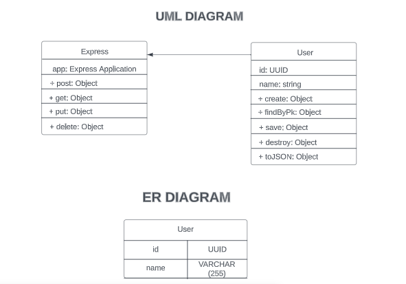

# HNG STAGE 2

## This repository builds a CRUD application

## Endpoints and local setup and remote access is described in DOCUMENTATION.md file

## UML and ER diagram of the application


## A test script is provided

(`testScript.js`) is designed to test the CRUD (Create, Read, Update, Delete) operations of a user management API located at `http://localhost:5000/api`. It uses the Axios library to send HTTP requests to the API.

### Prerequisites

Before running this script, ensure you have the following prerequisites installed:

- Node.js

### Usage

- Clone the repository containing this script:

- Navigate to the script's directory:

- install dependencies using `npm install`

- Run the script with the following command:

```node testScript.js "name" "update name"```

- Replace "name" with the desired name for creating a new user and "update name" with the desired name for updating the user.

Example:

```node testScript.js "John Doe" "Updated John"```

- The script will perform the following operations:

- Create a new user.
- Retrieve the created user.
- Update the created user.
- Retrieve the updated user.
- Delete the created user.
- Attempt to retrieve the deleted user (should return an error).

### Script Details
- The script takes two command-line arguments: name and update name. Both are required.

- The script sends HTTP requests to the user management API at http://localhost:5000/api.

- It logs the results of each operation, including successful responses and errors.

- If any of the required arguments are missing, the script will display usage instructions.

